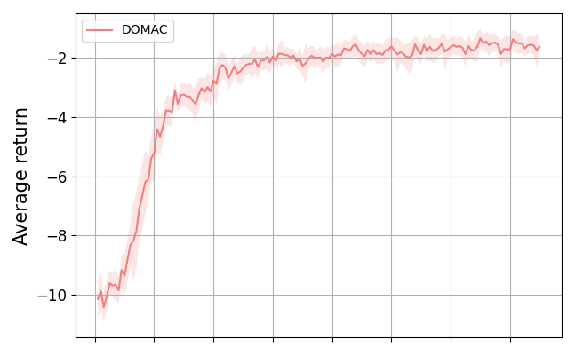

# Pytorch implementation of Decision-making with Speculative Opponent Models

Paper:  https://arxiv.org/abs/2211.11940


This repository is the official PyTorch implementation of the algorithms in the following paper:

Jing Sun, Shuo Chen, Cong Zhang, Jie Zhang. Decision-making with Speculative Opponent Models. Sun, Jing, Cong Zhang, and Jie Zhang. "Decision-making with Speculative Opponent Models." arXiv preprint arXiv:2211.11940 (2022).


## Environment

The model was tested on the ma-gym Switch2-v0 environment (https://github.com/koulanurag/ma-gym/wiki/Environments#Switch)


## Installation
Setup (important):
```commandline
pip install  'pip<=23.0.1'
pip install 'setuptools<=66'
pip install 'wheel<=0.38.4'
```


Install package:
Using PyPI:
```commandline
pip install ma-gym
```

Directly from source (recommended):
```commandline
git clone https://github.com/koulanurag/ma-gym.git
cd ma-gym
pip install -e .
```
## Run
```commandline
python3 main_domac.py

```
## Results

Policy:




